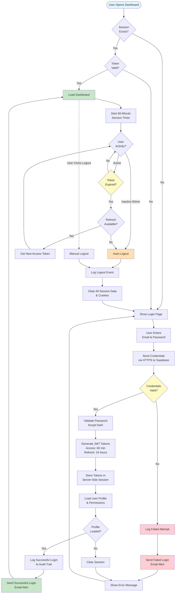
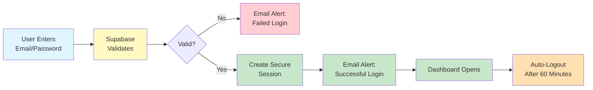

# Authentication Flow - BPC Dashboard

## Visual Flowchart

---

## Simplified Flow for CFOs

---

## Key Security Features

### 🔒 **Email Notifications**
- **Successful Login**: You receive an email every time your account is accessed
- **Failed Login**: You receive an email when wrong password is entered
- **Why it matters**: Immediate alert if someone tries to hack your account

### ⏱️ **60-Minute Auto-Logout**
- Sessions expire automatically after 1 hour
- **Analogy**: Like an ATM that cancels your transaction if you walk away
- **Why it matters**: Prevents hijacking if you forget to log out

### 🔐 **Password Security**
- Passwords are scrambled immediately (never stored as plain text)
- Even admins can't see your password
- **Analogy**: One-way shredder - once paper goes in, you can't get it back

### 📝 **Audit Trail**
- Every login/logout logged with timestamp and IP address
- Failed login attempts tracked
- **Why it matters**: Complete accountability - you can always see who did what and when

---

## Technical Details (For IT Manager)

### Authentication Protocol
- **Method**: JWT (JSON Web Tokens)
- **Password Hashing**: bcrypt with cost factor 10 (1,024 iterations)
- **Token Expiry**: Access token = 60 minutes, Refresh token = 24 hours
- **Cookie Settings**: `HttpOnly=true`, `Secure=true`, `SameSite=strict`

### Session Management
- Server-side session storage (not browser-based)
- Token signature validation on every request
- Automatic token refresh within 24-hour window
- Server-side token invalidation on logout

### Email Notification System
- SMTP-based email delivery
- HTML email templates with security details
- Includes: timestamp, IP address, login status
- Sent for both successful and failed login attempts

### Security Standards
- **Encryption in Transit**: TLS 1.2+ (HTTPS)
- **Encryption at Rest**: AES-256
- **Compliance**: OWASP Top 10 aligned, GDPR compatible
- **Platform**: Supabase (SOC 2 Type II certified)

---

## Flow Explanation

### Step-by-Step Authentication

1. **User Visits Dashboard**
   - System checks if valid session exists
   - If yes, validates token signature and expiry
   - If valid, loads dashboard immediately

2. **Login Required**
   - User enters email and password
   - Credentials sent over HTTPS to Supabase
   - Supabase validates against bcrypt-hashed password

3. **Failed Login**
   - Attempt logged to audit trail
   - Failed login email sent to user
   - Error message shown to user
   - User can try again

4. **Successful Login**
   - JWT tokens generated (access + refresh)
   - Tokens stored in server-side session
   - User profile and permissions loaded
   - Successful login logged to audit trail
   - Success email sent to user
   - Dashboard loads

5. **Active Session**
   - 60-minute timer starts
   - Every page load validates token
   - Token automatically refreshed if within 24-hour window
   - User activity resets idle timer

6. **Session Expiry**
   - After 60 minutes of inactivity, auto-logout
   - Or user manually clicks logout
   - Logout event logged to audit trail
   - All session data and cookies cleared
   - User redirected to login page

---

## Security Benefits

### Defense in Depth (7 Layers)

1. **Network Layer**: TLS 1.2+ encryption (HTTPS)
2. **Platform Layer**: Render DDoS protection
3. **Application Layer**: Supabase authentication
4. **Session Layer**: JWT token validation
5. **Database Layer**: PostgreSQL Row-Level Security
6. **Audit Layer**: Complete logging of all events
7. **User Layer**: Email notifications for awareness

### Zero Trust Model

- Every request is validated (no assumed trust)
- Tokens expire quickly (reduces hijack window)
- Permissions checked at 3 levels:
  1. UI (hide/disable unauthorized elements)
  2. Application (permission checks before actions)
  3. Database (RLS policies block unauthorized queries)

---

**Created for**: BPC Dashboard Presentation
**Audience**: CFOs + IT Manager
**Last Updated**: December 2025
